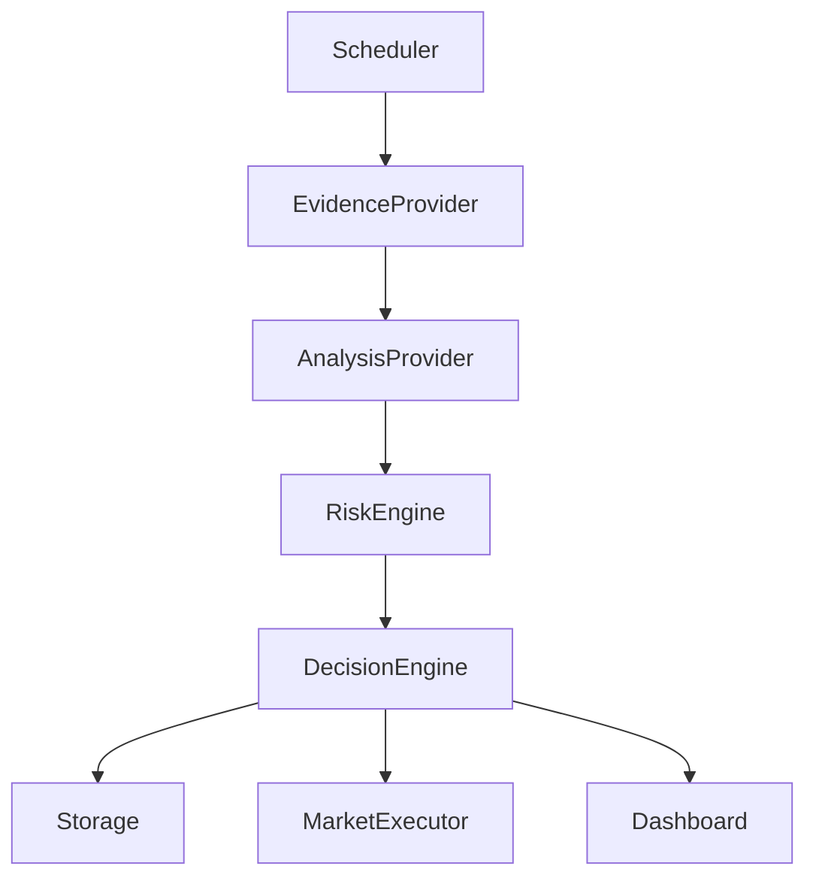
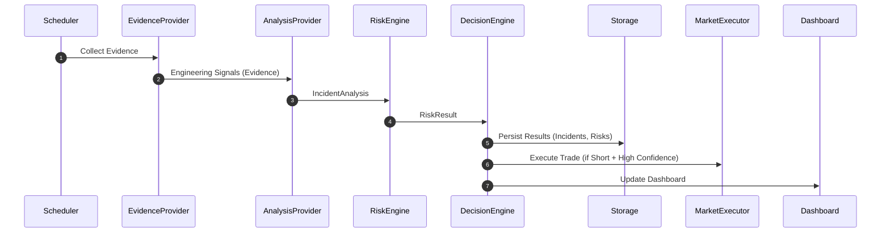

# HedgeOps (v2.0)

HedgeOps is a headless B2B SRE/DevOps intelligence platform designed to predict infrastructure fragility and automate financial risk hedging via prediction market execution.

It continuously crawls repository metrics, GitHub issues, cloud provider status indicators, and security advisories (via the **Anakin API**), scores catastrophic technical debt risk using a mathematical SRE probability model, and executes automated downside prediction market actions on the **Bento SDK** to hedge system fragility.

---

## 1. System Architecture



### Sequence Flow


---

## 2. Directory Structure

```text
HedgeOps/
├── data/                       # Persistent JSON database (Append-only)
│   ├── incidents.json
│   ├── risk-history.json
│   ├── transactions.json
│   ├── scheduler-state.json
│   └── health.json
├── src/
│   ├── config/
│   │   └── env.ts              # Strongly-typed configuration parsed with Zod
│   ├── prompts/
│   │   └── incidentAnalysis.ts            # Type declarations
│   ├── utils/
│   │   ├── logger.ts           # Colored, level-filtered structured logging
│   │   ├── retry.ts            # Retry backoff: Attempt 1 -> 1s -> Attempt 2 -> 2s -> Attempt 3 -> 4s
│   │   └── timer.ts            # Timer sleep utility
│   ├── core/
│   │   ├── interfaces.ts       # Core Provider contracts (Clean Architecture)
│   │   ├── riskEngine.ts       # SRE Mathematical risk equation calculation
│   │   └── decisionEngine.ts   # Decision matrix & AI confidence policy
│   ├── infrastructure/
│   │   ├── anakinAdapter.ts    # Extractor adapter (Anakin API / Mock evidence)
│   │   ├── brainAdapter.ts     # Analysis adapter (LLM / Heuristic local parser)
│   │   ├── bentoAdapter.ts     # Prediction market executor (Bento SDK / Mocks)
│   │   ├── storageAdapter.ts   # Append-only file persistence
│   │   └── circuitBreaker.ts   # Circuit breaker (CLOSED, OPEN, HALF-OPEN states)
│   ├── scheduler/
│   │   └── driftScheduler.ts   # Drift-compensated loop scheduler
│   ├── simulator/
│   │   └── incidentSimulator.ts# Simulated SRE failure tracks
│   ├── dashboard/
│   │   └── terminalDashboard.ts# chalk & cli-table3 dashboard
│   └── index.ts                # Application entrypoint & signal registration
├── tests/
│   ├── unit/                   # Mathematics, confidence logic & scheduler tests
│   ├── integration/            # Adapter connection & file persistence tests
│   └── e2e/                    # Simulated tracks pipeline runs
├── Dockerfile
├── docker-compose.yml
├── .dockerignore
├── package.json
├── tsconfig.json
├── jest.config.json
├── .env.example
└── README.md
```

---

## 3. Mathematical Risk Model

The probability $P$ of catastrophic infrastructure failure is calculated as:

$$P = S \times M \times (1 - e^{-\lambda t}) \times RepositoryHealth \times IssueVelocity \times SecurityWeight$$

### Multipliers
* **Decay Constant ($\lambda$)**: `0.15`
* **Severity Weight ($S$)**: `HIGH` = 0.85, `MEDIUM` = 0.50, `LOW` = 0.20
* **Sentiment Multiplier ($M$)**: `FRUSTRATED` = 1.20, `STALLED` = 1.20, `ACTIVE` = 0.90
* **Time ($t$)**: `daysStagnant` (stagnancy period computed by AI Brain)
* **Repository Health Multiplier**: `EXCELLENT` = 0.80, `AVERAGE` = 1.00, `POOR` = 1.25
* **Issue Velocity Multiplier**: `LOW` = 0.90, `NORMAL` = 1.00, `HIGH` = 1.20
* **Security Weight Multiplier**: `CRITICAL` = 1.30, `HIGH` = 1.15, `MEDIUM` = 1.00, `LOW` = 0.90

---

## 4. Decision Matrix & AI Confidence Policy

### Decision Matrix
| Computed Risk Probability | Recommendation | SRE Action |
| --- | --- | --- |
| $P < 0.40$ | `IGNORE` | No Action (`NONE`) |
| $0.40 \le P < 0.60$ | `MONITOR` | Continue Polling (`POLL`) |
| $0.60 \le P < 0.75$ | `ALERT` | Display Warning (`WARN`) |
| $P \ge 0.75$ | `SHORT` | Execute Prediction Market Trade (`EXECUTE`) |

### AI Confidence Policy
* **Confidence $\ge 0.80$**: Proceed with full calculated recommendation (execute predictions).
* **Confidence $0.50 - 0.79$**: Downgrade SRE Action to `WARN` and recommendation to `ALERT` (no trade execution).
* **Confidence $< 0.50$**: Discard prediction, downgrade to `IGNORE`/`NONE` (no trade execution).

---

## 5. Runtime Modes

1. **LIVE**: Connects to the real live Anakin API endpoint, queries Gemini/OpenAI API, and runs actual prediction trades on Bento SDK.
2. **HYBRID**: Connects to the real live Anakin API and queries LLM models, but mocks Bento SDK trades. Excellent for demonstration runs to avoid burning prediction credits.
3. **SIMULATION**: Connects entirely offline. Mocks Anakin, Brain, and Bento endpoints. Ideal for testing and presentations.

---

## 6. Installation & Configuration

### Prerequisites
* Node.js >= 22
* npm

### Installation
```bash
git clone <repository_url>
cd HedgeOps
npm install
```

### Environment Settings
Create a `.env` file in the root based on `.env.example`:
```ini
ANAKIN_API_KEY=mock_anakin_key
ANAKIN_BASE_URL=https://api.anakin.sre/v1
BENTO_API_KEY=mock_bento_key
BENTO_PRIVATE_KEY=mock_bento_private_key
TARGET_REPO=facebook/react
POLL_INTERVAL=60000
LOG_LEVEL=debug
NODE_ENV=development
```

---

## 7. Execution Scripts

### Run in Development
```bash
npm run dev
```

### Run SRE Simulation Modes
Allows testing the pipeline completely offline.
```bash
# Cycle through all three incident types
npm run simulate

# Simulate specific tracks
npm run simulate -- --dependency
npm run simulate -- --outage
npm run simulate -- --exploit
```

### Run SRE Hybrid Demo Mode
Queries real Anakin data but mocks trade executions.
```bash
npm run demo
```

### Run Diagnostic Health Check
Runs one evaluation tick, writes metrics to `data/health.json`, and exits.
```bash
npm run health
```

### Run Test Suite
Runs the full Jest test suite (unit, integration, and E2E simulation tests).
```bash
npm run test
```

### Build & Run Compiled Production Version
```bash
npm run build
npm run start
```

---

## 8. Docker Support

### Build and Run
Ensure your environment variables are configured. Then boot the container:
```bash
docker-compose up --build -d
```
The Docker setup utilizes volume mapping so your local `data/` folder keeps all logs and health check transaction records.

---

## 9. Future Adapters
The codebase is structured under Clean Architecture interfaces. New SRE evidence inputs or prediction engines can be added by implementing the providers in `src/core/interfaces.ts` and injecting them into the scheduler:
* **Evidence Provider**: GitLab, Jira, PagerDuty, Grafana, Datadog adapters.
* **Execution Provider**: PolyMarket, Gnosis, Custom hedging networks.
