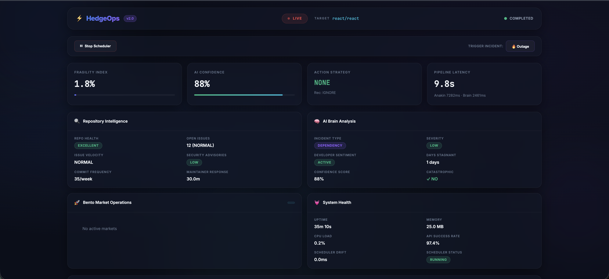
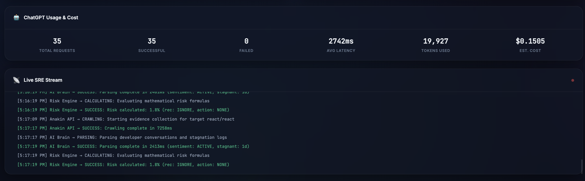
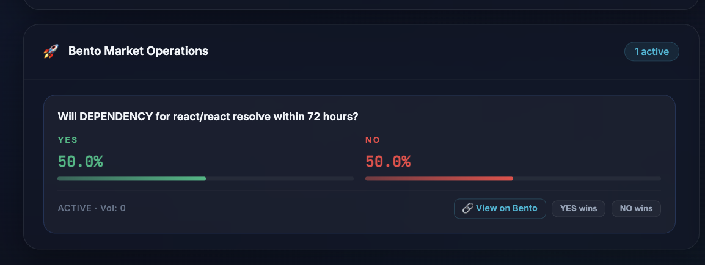
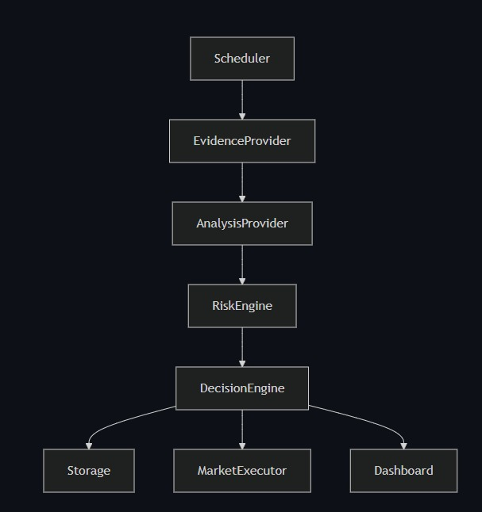
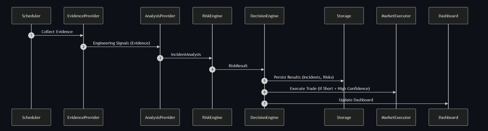

# Project name


## Project

| Field | Your answer |
|-------|-------------|
| **Project name** | HedgeOps|
| **Tagline** | We are financializing technical debt.|
| **Team name** | HedgeOps|
| **Team members** | Mantej Singh, Vidip Ghosh|
| **Contact email** |singhmantej536@gmail.com, ghoshvidip26@gmail.com|
| **Track** (if applicable) | |

### Links

| | URL |
|---|-----|
| **Live demo** | https://hedgeops.vercel.app/|
| **Demo video** (≤2 min) or slide deck |https://docs.google.com/presentation/d/1i5XoDpsmzeVpYjLMe44AqjI0zIetbrSf-ToW1YmxxiU/edit?usp=sharing |
| **Pitch deck** (optional) | |

---

## What you built

Describe the product in 3-6 sentences: who it is for, what problem it solves, and how it uses Bento.

HedgeOps is an autonomous infrastructure hedging protocol built specifically for DevOps teams and Site Reliability Engineers (SREs). It solves the massive financial bleed caused by critical cloud outages and unpatched vulnerabilities, where enterprise SLA breaches can cost thousands of dollars per minute without any downside protection. Our AI-driven risk engine continuously monitors system fragility and developer sentiment to predict catastrophic failures in real-time. When a critical threshold is crossed, HedgeOps leverages the Bento SDK's core lifecycle modules—specifically BentoSDK.markets.create and BentoSDK.trades.place—to programmatically instantiate on-chain prediction markets. By automatically executing high-conviction short positions against the incident's recovery timeline, HedgeOps transforms Bento into an enterprise-grade technical insurance policy.

### Screenshots

Add 2-4 screenshots or GIFs under `./assets/` and embed them here.





---

## Bento integration

For each surface: put **Yes** or **No**. If Yes, briefly describe how (SDK methods, feature, etc.).

| Surface | Yes / No | Describe (if Yes) |
|---------|----------|-------------------|
| Markets / duels (browse, bet, create) | Yes | `sdk.user.createDuel()` to create prediction markets, `sdk.user.bets.estimateBuy()` for price quotes, `sdk.user.placeBetFromEstimate()` to place bets on YES/NO outcomes, `sdk.public.getDuelById()` to poll live odds, and direct `POST /bento/user/duels/resolve` to settle markets with a winning option. |
| Multi-outcome / parent markets | No | |
| Parlays | No | |
| Tournaments / F1 / fantasy | No | |
| Packs | No | |
| Polymarket bridge | No | |
| Agents | Yes | HedgeOps itself is an autonomous AI agent — it uses GPT-5.5 to analyze repository telemetry, compute fragility risk scores, and autonomously create/bet/resolve prediction markets on Bento without human intervention. |
| Realtime / social | No | |
| Others | Yes | `sdk.public.auth.eoaLogin()` / `eoaRegister()` for EOA wallet authentication with `jwtAuthProvider`, and `POST /bento/auto-mint/mint` faucet endpoint to mint testnet credits before trading. |


**Builder API key:** minted from [docs.bento.fun - Builder API key](https://docs.bento.fun/concepts/builder-api-key) (testnet). Do **not** commit keys.

---

## How to run

```bash
# from this folder, or link to your external repo
cp .env.example .env   # fill env vars
npm install            # or pnpm / yarn
npm run dev
```
| Env var | Required | Description |
|---------|----------|-------------|
| `ANAKIN_API_KEY` | yes | Anakin SRE API key |
| `ANAKIN_BASE_URL` | yes | Anakin API base URL (`https://api.anakin.sre/v1`) |
| `BENTO_BUILDER_API_KEY` | yes | Testnet builder key |
| `BENTO_PRIVATE_KEY` | yes | Bento private key |
| `BENTO_URL` | yes | Markets host (`https://api.bento.fun`) |
| `PARLAY_TOURNMENT_URL` | if needed | Tournaments endpoint (`https://tournaments.bento.fun`) |
| `TARGET_REPO` | yes | GitHub repo to monitor (e.g. `facebook/react`) |
| `POLL_INTERVAL` | no | Polling interval in ms (default: `60000`) |
| `LOG_LEVEL` | no | Logging level (default: `debug`) |
| `NODE_ENV` | no | Environment (`development` / `production`) |
| `OPENAI_API_KEY` | yes | OpenAI API key |
| `OPENAI_MODEL` | no | OpenAI model to use (default: `gpt-5.5`) |
| `OPENAI_BASE_URL` | no | OpenAI API base URL (`https://api.openai.com/v1`) |
| `OPENAI_TIMEOUT_MS` | no | OpenAI request timeout in ms (default: `30000`) |

---

## Architecture (short)

- **Stack:** TypeScript, Node.js, Express, Bento SDK (`@bento.fun/sdk`), OpenAI API, Viem, Zod
- **Repo layout:**
  - `src/config/` — Environment & CLI arg parsing (Zod-validated)
  - `src/core/` — Risk engine, decision engine, shared interfaces
  - `src/infrastructure/` — Bento adapter, Anakin adapter, ChatGPT provider, circuit breaker, storage
  - `src/prompts/` — LLM prompt templates (incident analysis, retry, system)
  - `src/scheduler/` — Drift-aware polling scheduler
  - `src/simulator/` — Incident simulation (dependency, outage, exploit)
  - `src/dashboard/` — Terminal UI + Express web dashboard
  - `src/utils/` — Logger, retry helper, timer
  - `public/` — Frontend dashboard (HTML/CSS/JS)
  - `data/` — JSON-based local persistence (health, incidents, ledger, risk history)
- **Auth:** EOA wallet signature via Viem (`privateKeyToAccount` → sign message → JWT login/register through Bento SDK)
- **What's on-chain vs off-chain:**
  - *On-chain:* Prediction market creation, YES/NO bet placement, market resolution (all via Bento SDK on testnet)
  - *Off-chain:* Evidence crawling (Anakin API), AI incident analysis (OpenAI), risk scoring, scheduling, dashboard, local data persistence

## Architecture Diagram


## Sequence Flow Diagram
